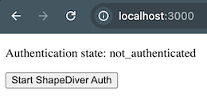
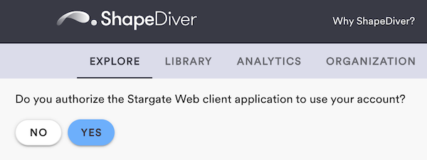
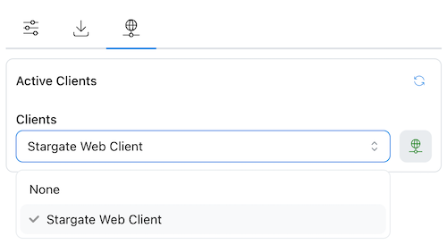
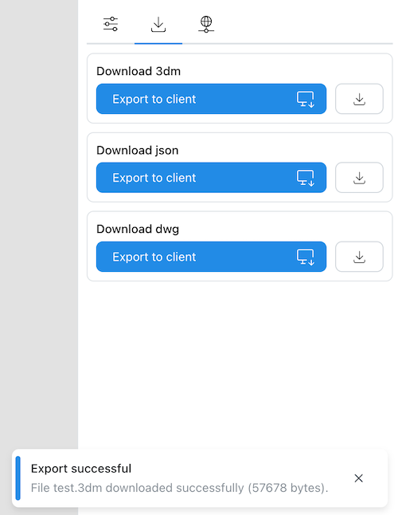

# Stargate Web Client Example

This repository contains an minimal React app acting as a "desktop client application" for ShapeDiver. Read more about connecting client applications to ShapeDiver [here](https://help.shapediver.com/doc/shapediver-desktop-clients). 

## How to use this

The code provided in this repository makes it as easy as possible to integrate web applications implemented using React with ShapeDiver. Easily send data to and from ShapeDiver. This allows to extend web applications using the power of Grasshopper models running on ShapeDiver. ShapeDiver provides the most secure, scalable, reliable, and performant infrastructure to turn Grasshopper models into cloud applications. 

If your web application is not implemented using React, you should still be able to reuse lots of the provided code. 

See the bottom of this README for details on how to use the code. 

## Getting started

### Create a ShapeDiver account

Create an account on the [ShapeDiver platform](https://www.shapediver.com/app/). You need a paid subscription to use 
the desktop client feature. It's possible to register for a free trial.

### Upload the example Grasshopper model

Upload the [example Grasshopper model](StargateWebClientExampleRhino8.ghx) contained in this repository. The Grasshopper model contains three [import components](https://help.shapediver.com/doc/import-components), and three corresponding [export components](https://help.shapediver.com/doc/download-export). The imported data is piped directly from the import components to the export components. Also, the imported geometry is fed into [display components](https://help.shapediver.com/doc/gltf-2-0-display) for rendering it in the 3D view. 

Once model checking has completed, click "Save" on the model edit page. Now click "Open App". 

You should see an empty 3D view, because the example model doesn't output geometry by default. 
The opened App shows the following default user interface, corresponding to the import and export components: 

Note the "No active client found" message, telling us that no client application is currently connected. 

### Start the local React application

> [!WARNING] 
> Local testing is not allowed when using the productive ShapeDiver platform.
> However, you can use a service like https://ngrok.com/ to provide a public URL for your localhost.
> Your public URL will need to be whitelisted by ShapeDiver. Write to us at contact@shapediver.com
> and ask us about it. 
> As an alternative, you can test a deployed version of this example [here](https://appbuilder.shapediver.com/stargate/v1/main/development/). 

As a prerequisite install [Node.js 20](https://nodejs.org/en/about/previous-releases) and [pnpm](https://pnpm.io/). 

Run `pnpm i` to install the required dependencies. 

Now run `pnpm start`. A browser tab should open and show this: 

Clicking "Start ShapeDiver Auth" will redirect you to the ShapeDiver Platform, which will ask you to authorize the example application: 

Clicking "Yes" will take you back to the locally running example application. You should see this: 

### Test the connection

Go back to the opened App, select the "Desktop clients" tab, and click the refresh icon. 
The dropdown should show the "Stargate Web Client". Select it.

Now select the "Parameters" tab. You should see that the parameter components have been enabled. 
Clicking one of the orange buttons will trigger a file import from the local React application. 
Give it a try by clicking at least one of the buttons. 

Once the import and the computation of the Grasshopper 
model have finished, navigate to the "Exports" tab. Clicking the corresponding "Export to client" button triggers a download 
of the file exported from Grasshopper in the local React application. 

## How to get started with the code

Most of the code is contained in hooks that can easily be reused in other React apps. 

  * [useShapeDiverAuth](src/hooks/useShapeDiverAuth.ts) - Hook to manage authentication with ShapeDiver via OAuth2 Authorization Code Flow with PKCE.
  * [useShapeDiverStargate](src/hooks/useShapeDiverStargate.ts) - Hook providing a ShapeDiver Stargate Client implementation. The ShapeDiver Stargate service is used to communicate between ShapeDiver Apps and client applications by relaying event messages via websocket connections. 

Code specific to this example: 

  * [useStargateHandlers](src/hooks/useStargateHandlers.ts) - Example handlers for the "GET DATA" and "EXPORT FILE" commands, showing how to send data to [import components](https://help.shapediver.com/doc/import-components) and how to get data from [export components](https://help.shapediver.com/doc/download-export).
  * [HomePage](src/pages/HomePage.tsx) - Example page, showing how to make use of the hooks. 

## ShapeDiver SDKs used

  * [Platform SDK](https://www.npmjs.com/package/@shapediver/sdk.platform-api-sdk-v1)
  * [Geometry SDK](https://www.npmjs.com/package/@shapediver/sdk.geometry-api-sdk-v2)
  * [Stargate SDK](https://www.npmjs.com/package/@shapediver/sdk.stargate-sdk-v1)

## Planned extensions

  * Extend the "GET DATA" handler by an example on how to send data to [structured inputs](https://help.shapediver.com/doc/inputs-and-outputs#Defininginputs-Usefloatingparametersasstructuredinputs). 
  * Implement an example "BAKE DATA" handler, allowing to get structured data from [output components](https://help.shapediver.com/doc/shapediver-output#ShapeDiverOutput-clientUsagewithdesktopclients).

## Related links

You can find a similar example for connecting .NET applications to ShapeDiver [here](https://github.com/shapediver/StargateDotNetClientExample).

 
